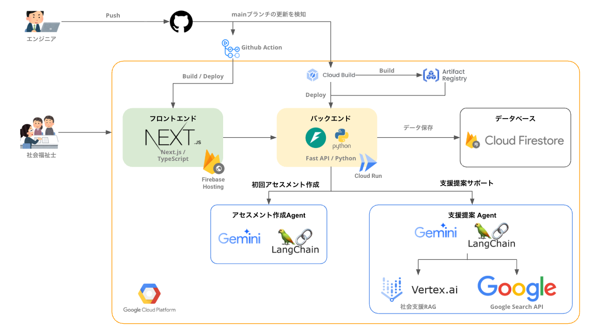

# Fukushia - 社会福祉士向けアセスメント支援アプリ

[](https://github.com/teritamas/fukushia/actions/workflows/ci.yml)
[](https://github.com/teritamas/fukushia/actions/workflows/firebase-hosting-merge.yml)

社会福祉士向けのメモ・タスク管理＆アセスメント支援アプリです。Streamlit で動作し、Firebase Firestore と Gemini API を利用します。

- [デモサイト](https://tritama-e20cf.web.app/)
- [API Docs](https://fukushia-assistant-backend-667712908416.europe-west1.run.app/docs)

## 全体構成

本アプリケーションは GCP 上にデプロイされており、`main`ブランチへのマージでフロントエンドとバックエンドが自動でデプロイされます。



## 起動方法

本プリケーションの開発には Node.js (v20-24) と Python (>=3.11) が必要です。`nvm` や `pyenv` などのバージョン管理ツールを利用することをお勧めします。

### 環境変数の設定

初回起動時、フロントエンドとバックエンドで環境変数を設定する必要があります。

- `application/`フォルダー内に `.env` ファイルを作成し、以下の内容を記述してください:

```txt
# Firebaseサービスアカウントキー
FIREBASE_SERVICE_ACCOUNT = サービスアカウントのキーを1行で書く

# Gemini APIキー
GEMINI_API_KEY="あなたのGemini APIキー"
GOOGLE_CSE_ID="あなたのGoogle CSE ID"

# Firebase ID
TARGET_FIREBASE_APP_ID="Firebase App ID"
TARGET_FIREBASE_USER_ID="Firebase User ID"

# RAG Engine (Vertex RAG Store)
RAG_PROJECT_ID="RAGが含まれるプロジェクトID"
RAG_LOCATION="RAGが含まれるリージョン"
RAG_CORPUS_RESOURCE="RAGのコーパスリソース"
RAG_MODEL="RAGで利用するLLMのモデル名"
```

- `frontend/`フォルダー内に `.env` ファイルを作成し、以下の内容を記述してください

```txt
NEXT_PUBLIC_FIREBASE_API_KEY=
NEXT_PUBLIC_FIREBASE_AUTH_DOMAIN=
NEXT_PUBLIC_FIREBASE_PROJECT_ID=
NEXT_PUBLIC_FIREBASE_STORAGE_BUCKET=
NEXT_PUBLIC_FIREBASE_APP_ID=
NEXT_PUBLIC_FIREBASE_MESSAGING_SENDER_ID=
NEXT_PUBLIC_FIREBASE_MEASUREMENT_ID=
NEXT_PUBLIC_FIREBASE_CLIENT_EMAIL=

NEXT_PUBLIC_API_BASE_URL=http://localhost:8000
```

### フロントエンドの起動

```sh
cd frontend/
npm run dev
```

### バックエンドの起動

```sh
cd application/
uv run uvicorn main:app --reload
```

#### Docker で API サーバをビルド・実行する

Cloud Run で実行する場合は Docker を利用します。ローカルで Docker イメージをビルドして実行するには以下のコマンドを使用します。

```sh
cd application
docker build -t fukushia_api .
docker run --rm -p 8000:8000 fukushia_api
```

## AI Coding

Cline、Github Copilot を利用して開発することを想定しており、Agent が E2E で修正をしやすいように、本リポジトリはモノレポ構成になっています。

インストラクションは[AGENTS.md](https://agents.md/)を用いて管理しており、`.clinerules`は各フォルダの`AGENTS.md`へのシンボリックリンクとなっています。

インストラクションを修正する場合は、各フォルダの`AGENTS.md`を修正してください。

> [!IMPORTANT]
> インストラクションを更新するときは、`AGENTS.md`を更新してください。  
> `.clinerules/`は`AGENTS.md`に対するシンボリックリンクで同期されているため、直接更新しないでください。
